# Architecture and Implementation Report

## 1. System Overview

This project implements a Graph RAG MVP for Coal Handling Plant (CHP) training material. The system answers user questions by retrieving grounded evidence from course HTML files, inline diagrams, and a structured CHP workbook, then compressing that evidence before answer generation. The implemented architecture is intentionally evidence-first: user questions are never sent directly to the answer model as free-form prompts. They are converted into embeddings, matched against stored evidence objects, expanded through a lightweight knowledge graph, compressed into a citation-preserving context package, and only then used for answer generation.

At a high level, the runtime query path is:

```text
User Query
-> E5 query embedding
-> Weaviate vector retrieval over TextChunk, ImageChunk, and ConceptNode
-> lexical merge and reranking
-> ConceptNode seed selection
-> RelationChunk graph expansion
-> evidence assembly
-> compact context construction
-> grounded answer generation
-> API response with answer, references, diagrams, and coverage notes
```

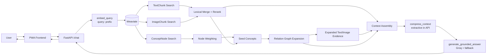

The system has four major data object types:

| Object | Purpose | Source |
| --- | --- | --- |
| `TextChunk` | Stores semantically meaningful course text sections. | HTML headings and content blocks. |
| `ImageChunk` | Stores diagram/image descriptions so visuals can participate in semantic retrieval. | Inline `svg` and `img` elements in HTML. |
| `RelationChunk` | Stores graph edges from the CHP workbook. | `Data/CHP WRCF.xlsx`. |
| `ConceptNode` | Joins text evidence, image evidence, and relation endpoints around normalized concept IDs. | Built from all three object streams. |

The current ingestion artifact report contains 196 text chunks, 34 image chunks, 748 relation chunks, and 938 concept nodes. The report validates required fields and uniqueness for all object types.

## 2. End-to-End Pipeline

The end-to-end architecture has two separate but connected flows:

1. Offline or developer-triggered ingestion builds the knowledge base.
2. Online retrieval and answer generation serves user queries.

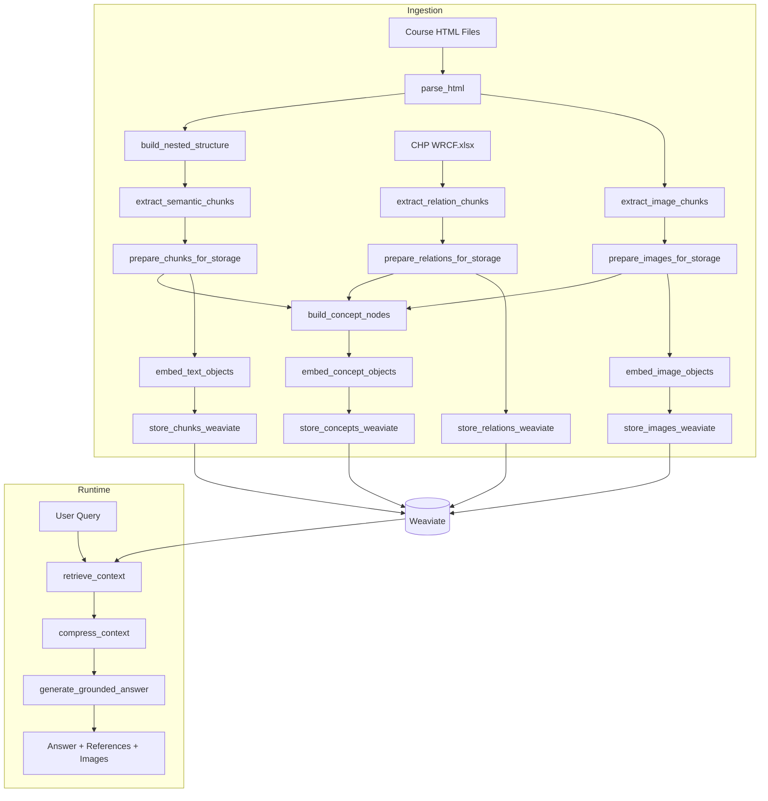

The design separates ingestion from query-time operation because embeddings and graph construction are expensive relative to a user request. The API expects Weaviate to already contain embedded objects. At runtime it only embeds the query and performs retrieval, expansion, compression, and generation.

## 3. Document Ingestion Pipeline

The ingestion entry point is `ingest_html_files()` in `src/extraction/pipeline.py`. It accepts one or more HTML files, optionally embeds objects, optionally stores them in Weaviate, and always returns artifacts suitable for inspection and validation.

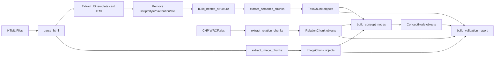

### HTML Parsing

`parse_html()` reads each source file with UTF-8 fallback behavior and uses BeautifulSoup with the `lxml` parser. The parser also extracts JavaScript template strings matching `html:\`...\`` and appends them to the soup. This exists because some iCard-style course content is embedded inside JavaScript template literals rather than plain body markup. Without this step, the ingestion pipeline would miss card content that is visible to learners.

Noise selectors (`script`, `style`, `noscript`, `iframe`, `nav`, `button`) are removed before section extraction. This prevents navigation text and UI control labels from becoming retrieval evidence.

### Nested Section Tree

`build_nested_structure()` creates a heading tree using:

| Signal | Meaning |
| --- | --- |
| `h1` to `h4` | Standard HTML heading levels. |
| `card-h1`, `card-h2` | Course-card heading classes mapped to levels 1 and 2. |
| `p`, `li`, `table`, `blockquote`, `figcaption`, `caption`, `text` | Content-bearing tags. |
| `card-p`, `svg-cap`, `cl`, `flow-step`, `quiz-opt`, etc. | Course-specific content classes. |

Each node stores title, content, children, level, `section_id`, `source_file`, and parent title. Tables are converted into readable row text with pipe-separated cells. The tree preserves hierarchy so later chunks know their breadcrumb and child titles.

### TextChunk Creation

`extract_semantic_chunks()` walks the heading tree and emits chunks for non-root sections that have content. `prepare_chunks_for_storage()` normalizes these into `TextChunk` objects.

| Field | Meaning |
| --- | --- |
| `id` | Stable SHA-1-based 32-character ID from source file, section ID, title, and content. |
| `content` | Title plus cleaned section content. |
| `title` | Section title. |
| `parent_title` | Parent heading title. |
| `concept_id` | Normalized slug from title. |
| `section_id` | Source-section slug. |
| `source_file` | HTML file name. |
| `type` | Inferred `risk`, `procedure`, or `concept`. |
| `metadata.level` | Heading depth. |
| `metadata.breadcrumb` | Full title path. |
| `metadata.child_titles` | Immediate child headings. |
| `metadata.content_length` | Character count of cleaned content. |

The `type` field is inferred from domain terms. Risk terms include words such as `risk`, `hazard`, `danger`, `failure`, `fire`, and `emergency`. Procedure terms include `procedure`, `sequence`, `step`, `inspection`, `checklist`, and `operation`. This lightweight classification is used later as a retrieval bonus for operationally useful evidence.

### ImageChunk Creation

`extract_image_chunks()` scans the parsed HTML for `svg` and `img` elements. Each visual is attached to the nearest active heading context. For SVGs, it extracts visible `<text>` labels and stores a raw SVG excerpt for diagnostics.

| Field | Meaning |
| --- | --- |
| `image_id` | Stable SHA-1-based 32-character ID from source file, section, order, type, labels, and caption. |
| `description` | Retrieval text describing the diagram context, caption, visible labels, and source file. |
| `title` | Nearest section title. |
| `parent_title` | Parent heading. |
| `concept_id` | Concept slug derived from the section title. |
| `section_id` | Linked text section ID. |
| `source_file` | HTML file name. |
| `type` | `svg` or `img`. |
| `metadata.linked_text_section_id` | Section containing the visual. |
| `metadata.caption` | Nearby caption, if found. |
| `metadata.svg_text_labels` | Deduplicated SVG text labels. |
| `metadata.view_box` | SVG viewbox. |
| `metadata.order_in_file` | Visual order. |
| `metadata.raw_svg_excerpt` | First 500 cleaned characters of SVG markup. |
| `metadata.breadcrumb` | Heading breadcrumb. |

Images are represented as text descriptions because the current embedding pipeline is text-only. This design allows diagrams to be retrieved semantically without requiring a multimodal embedding model.

### RelationChunk Creation

`extract_relation_chunks()` reads `Data/CHP WRCF.xlsx` with `openpyxl`. It maps workbook sheets to relation types:

| Sheet | Relation(s) |
| --- | --- |
| `FG & PWO` | Functional Group `has_pwo` Primary Work Object; PWO `depends_on` dependencies. |
| `SWO` | PWO `has_swo` Secondary Work Object. |
| `Skills` | SWO `has_skill` Skill. |
| `Tasks` | Skill `has_task` Task. |
| `Control Point` | Task `has_control_point` Control Point. |

Each relation includes `relation_id`, `source_id`, `target_id`, `relation_type`, `description`, and metadata with source workbook, sheet, row number, labels, and row evidence.

### ConceptNode Creation

`build_concept_nodes()` aggregates all text chunks, images, and relation endpoints by `concept_id`.

| Field | Meaning |
| --- | --- |
| `concept_id` | Stable normalized concept identifier. |
| `label` | Human-readable label from chunk title or relation label. |
| `node_type` | Currently `concept`. |
| `text_chunk_ids` | Supporting TextChunk IDs. |
| `image_ids` | Supporting ImageChunk IDs. |
| `source_relation_ids` | Relations where this concept is the source. |
| `target_relation_ids` | Relations where this concept is the target. |
| `metadata.has_evidence` | True if linked to text or image evidence. |
| `metadata.retrieval_weight` | `1.0` for evidence-backed nodes, `0.35` for relation-only nodes. |

ConceptNodes exist because the course material and workbook use overlapping but not identical representations of concepts. They provide a stable bridge between unstructured evidence and structured graph edges.

## 4. Architecture Diagrams

### Runtime Sequence

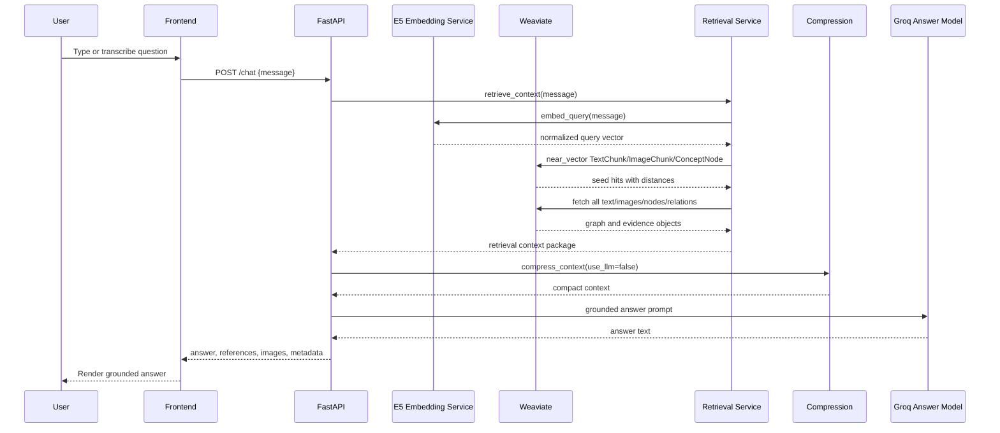

### Knowledge Object Relationships

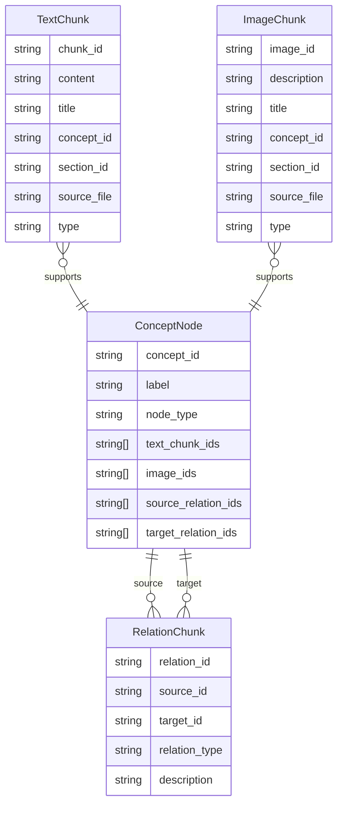

## 5. Data Models

The data model is intentionally denormalized for retrieval. Weaviate stores each object with its searchable text fields, metadata, and optionally a self-provided vector. Relations are stored as objects rather than native Weaviate references. That keeps ingestion simple, makes artifacts readable, and lets the retrieval service implement explicit traversal and scoring logic in Python.

### TextChunk

Purpose: represent one semantically meaningful course section.

Inputs: nested heading tree nodes from HTML.

Outputs: stored evidence block used directly in context assembly and answer citations.

Internal logic: chunks are emitted only when title and content exist; duplicate stable IDs are skipped; IDs are deterministic.

Dependencies: `html_parser.clean_text`, `concept_id`, SHA-1 hashing.

Why it exists: answer generation needs grounded course excerpts, not only graph nodes. TextChunk is the primary evidence type.

### ImageChunk

Purpose: make diagrams retrievable in a text-embedding pipeline.

Inputs: inline `svg`/`img` elements, captions, visible SVG text labels, nearest heading context.

Outputs: diagram descriptions for search and UI image references for rendering.

Internal logic: each image gets a stable ID and a retrieval description. SVGs can later be found again through `find_svg_by_image_id()` for `/images/{image_id}.svg`.

Dependencies: BeautifulSoup, heading context logic, caption extraction.

Why it exists: industrial training content often relies on diagrams. If the system only indexed text, visual evidence would be invisible to retrieval.

### RelationChunk

Purpose: represent structured CHP work-object hierarchy and dependencies as graph edges.

Inputs: workbook rows.

Outputs: graph edges used during expansion and compact relation traces.

Internal logic: each sheet maps to a relation type; row content is preserved as metadata evidence.

Dependencies: `openpyxl`, `concept_id`, SHA-1 hashing.

Why it exists: relations are different from text evidence. They express operational structure such as dependencies, skills, tasks, and control points, which can support multi-hop retrieval.

### ConceptNode

Purpose: unify evidence and graph endpoints.

Inputs: text object concept IDs, image object concept IDs, relation source and target IDs.

Outputs: retrievable concept objects and graph seed nodes.

Internal logic: evidence-backed nodes receive full retrieval weight; relation-only nodes remain searchable but are downweighted.

Dependencies: text, image, and relation object streams.

Why it exists: queries should retrieve meaningful concepts, but answers should be grounded in evidence. ConceptNode links query semantics to evidence and graph structure.

## 6. Embedding Pipeline

The current embedding model is `intfloat/multilingual-e5-small`, configured in `src/core/config.py`. The implementation uses `sentence-transformers`, normalized embeddings, and local model caching through an `lru_cache`.

This model is a practical MVP choice because it is multilingual, lightweight enough for local inference, compatible with semantic search, and supports the E5 instruction-style prefixes required for strong retrieval behavior.

### Prefixes

| Use | Prefix | Function |
| --- | --- | --- |
| Text chunks | `passage: ` | `embed_text_objects()` |
| Image descriptions | `passage: ` | `embed_image_objects()` |
| Relation-only concept fallback text | `passage: ` | `embed_concept_objects()` via `embed_passages()` |
| User queries | `query: ` | `embed_query()` |

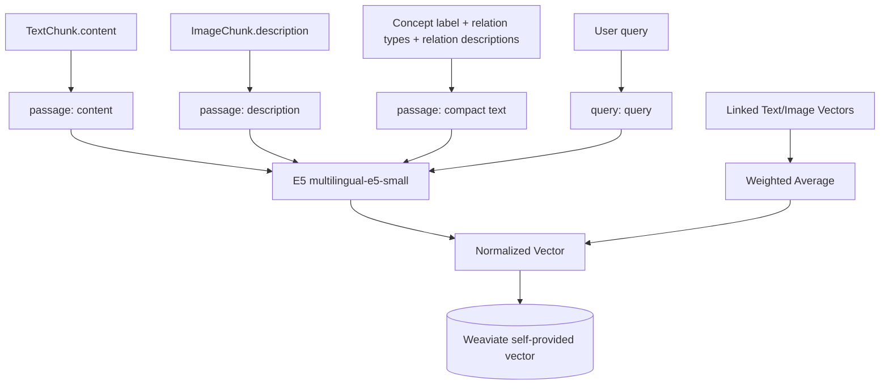

### Text Embeddings

`embed_text_objects()` embeds each `TextChunk.content`. Empty content is skipped. Embedded vectors are attached under `_vector`, then removed from properties during storage and passed as Weaviate self-provided vectors.

### Image Description Embeddings

`embed_image_objects()` embeds `ImageChunk.description`. This lets diagram descriptions participate in semantic search alongside course text.

### ConceptNode Embeddings

`embed_concept_objects()` uses an evidence-first strategy:

1. Build maps of text, image, and relation objects.
2. Mark each concept with `metadata.has_evidence`.
3. Set `retrieval_weight` to `1.0` for evidence-backed concepts and `0.35` for relation-only concepts.
4. For linked text vectors, add weight `1.0`.
5. For linked image vectors, add weight `0.8`.
6. Compute a normalized weighted average vector.
7. If no text/image evidence exists, build compact relation-only text from the concept label, relation types, and up to 10 relation descriptions, then embed it with the passage prefix.

This design biases retrieval toward concepts with actual evidence while still allowing workbook-only nodes to seed graph expansion when they are highly relevant.

### Query Embeddings

`embed_query()` adds the E5 `query: ` prefix and returns one normalized vector. The API warms the embedding model at startup through `warm_embedding_model()` so the first user query avoids model load latency.

## 7. Knowledge Graph Construction

The graph is not a separate database. It is materialized as `ConceptNode` and `RelationChunk` collections in Weaviate, then loaded into Python during retrieval. This keeps the MVP deployable with one storage service while still enabling graph traversal.

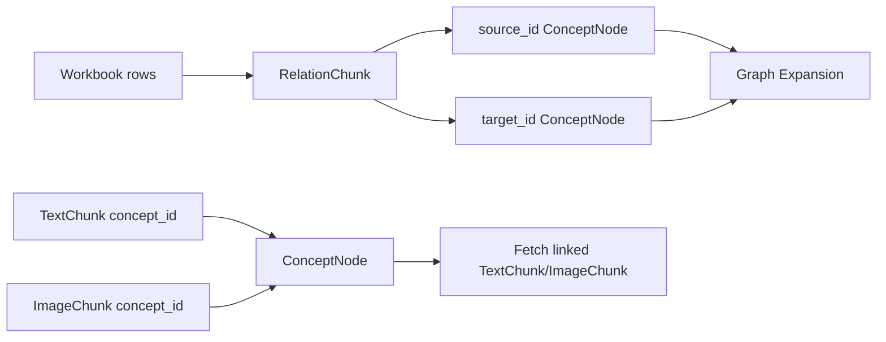

ConceptNodes are useful because retrieval has two different needs:

1. Semantic matching against concepts named in questions.
2. Evidence grounding in text/image chunks.

RelationChunks are stored separately because graph edges have their own metadata, row evidence, relation type, and scoring behavior. If relations were flattened into ConceptNodes, the system would lose traceability for why a graph hop was followed.

Chunks are not directly connected to queries. Queries are embedded and compared to indexed objects, but they are transient runtime inputs. Persisting query-to-chunk edges would mix user behavior with the source knowledge base and would not help the MVP answer a single question.

## 8. Retrieval Pipeline

The retrieval entry point is `retrieve_context()` in `src/retrieval/service.py`.

Default retrieval constants:

| Constant | Value | Meaning |
| --- | ---: | --- |
| `DEFAULT_TEXT_TOP_K` | 5 | Initial requested text hits before expansion and final context capping. |
| `DEFAULT_IMAGE_TOP_K` | 3 | Initial image hits. |
| `DEFAULT_NODE_TOP_K` | 5 | Displayed concept node hits. |
| `DEFAULT_MAX_HOPS` | 2 | Maximum graph traversal depth. |
| `DEFAULT_RELATION_LIMIT` | 30 | Maximum traversed relations. |
| `DEFAULT_MAX_CONTEXT_TEXT` | 8 | Final text blocks sent to compression. |
| `DEFAULT_MAX_CONTEXT_IMAGES` | 3 | Final image blocks sent to compression. |
| `DEFAULT_MAX_CONTEXT_RELATIONS` | 10 | Final relation blocks sent to compression. |

```mermaid
flowchart TB
    Query[Query] --> Embed[embed_query]
    Embed --> TextVector[Text near_vector<br/>limit text_top_k * 4]
    Embed --> ImageVector[Image near_vector<br/>limit image_top_k * 4]
    Embed --> NodeVector[Concept near_vector<br/>limit max(node_top_k * 5, 20)]

    Query --> Terms[_query_terms]
    Terms --> LexicalCandidates[Lexical evidence candidates]
    TextVector --> MergeText[Merge + rerank text]
    ImageVector --> MergeImage[Merge + rerank images]
    LexicalCandidates --> MergeText
    LexicalCandidates --> MergeImage
    NodeVector --> NodeWeight[retrieval_weight rerank]
    NodeWeight --> SeedConcepts
    MergeText --> SeedConcepts
    MergeImage --> SeedConcepts
    SeedConcepts --> ExpandGraph[_expand_graph]
    ExpandGraph --> ExpandedEvidence[_expanded_evidence]
    MergeText --> Context[_build_context_blocks]
    MergeImage --> Context
    ExpandedEvidence --> Context
    ExpandGraph --> Context
```

### Vector Search

Weaviate `near_vector` is used against `TextChunk`, `ImageChunk`, and `ConceptNode`. The returned distance is converted to a score as `max(0.0, 1.0 - distance)`.

### Lexical Merge

The system fetches all text and image objects, extracts query terms, and generates lexical candidates when query terms overlap titles/content/descriptions. Lexical candidates are merged with vector hits by `(collection, id)`. This protects important domain phrases, such as `belt drift`, from being lost when vector retrieval alone ranks generic course text too high.

### Evidence Reranking

`_score_evidence_hit()` adds bonuses for:

| Signal | Behavior |
| --- | --- |
| Query term overlap | Up to `0.16`. |
| Title overlap | Up to `0.18`. |
| Operational term overlap | Up to `0.12`. |
| Exact `belt drift` phrase | `0.3` boost. |
| Exact `fire risk` phrase | `0.18` boost. |
| `risk` or `procedure` type | `0.04` boost. |
| Graph relevance | Optional expansion boost. |

Generic instructional material receives penalties up to `0.6` when it contains terms such as course introductions, scoring guides, assessment language, or completion declarations.

### Context Assembly

`_build_context_blocks()` deduplicates text and image evidence by ID and content fingerprint, drops low-value generic chunks, sorts by rerank score, and caps final context to 8 text blocks, 3 image blocks, and 10 relation blocks unless `debug_full_context` is enabled.

The retrieval output includes:

| Key | Meaning |
| --- | --- |
| `seed_results` | Initial text, image, and concept matches. |
| `graph_expansion` | Expanded nodes, relations, trace, and relation-only seed nodes. |
| `expanded_evidence` | Additional text/images discovered through expanded concept IDs. |
| `context_for_llm_later` | Final bounded evidence package. |
| `retrieval_diagnostics` | Counts, drops, graph-disabled flag, and timings. |

## 9. Graph Expansion Logic

Graph traversal is implemented in `_expand_graph()`. The function builds an adjacency list from all RelationChunks, initializes a frontier from seed concept IDs, and performs bounded breadth-first expansion.

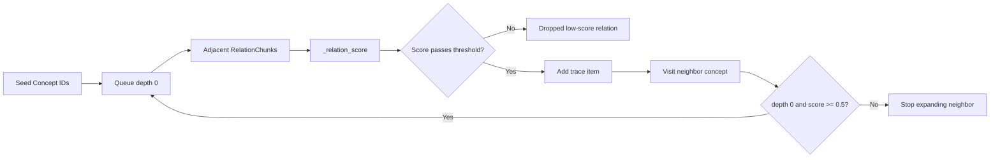

Relation scoring uses:

| Component | Purpose |
| --- | --- |
| Seed score | Carries confidence from the retrieved source concept. |
| Hop decay | `1.0` at depth 0, `0.65` after that. |
| Relation type weight | Prioritizes operationally meaningful relation types. |
| Evidence bonus | Adds `0.2` when the neighbor has text or image evidence. |
| Query overlap bonus | Adds up to `0.25` when relation labels/evidence overlap query terms. |

Relation type weights:

| Relation type | Weight |
| --- | ---: |
| `depends_on` | 0.90 |
| `has_control_point` | 0.85 |
| `has_task` | 0.75 |
| `has_skill` | 0.65 |
| `has_swo` | 0.60 |
| `has_pwo` | 0.55 |

Minimum graph relevance thresholds are `0.28` at depth 0 and `0.42` at deeper levels. A neighbor is only added to the next frontier from depth 0 when score is at least `0.5`. This keeps graph expansion from overwhelming retrieval with weakly related workbook edges.

Evidence-backed nodes differ from relation-only nodes in two places. During embedding, evidence-backed nodes use weighted text/image vectors and receive retrieval weight `1.0`; relation-only nodes are embedded from labels/relations and receive weight `0.35`. During expansion, relation-only nodes can still act as high-confidence seeds if their raw vector score is at least `0.85`, but only up to 3 such seed nodes.

Current graph challenges are visible in the smoke artifacts: some prompts produce no relation trace, while coal-flow and transfer-point prompts produce relation-backed traces. This suggests the graph is useful for workbook-aligned queries but still sensitive to concept ID alignment between HTML section titles and workbook labels.

## 10. Context Compression Pipeline

The compression entry point is `compress_context()` in `src/answering/compression.py`.

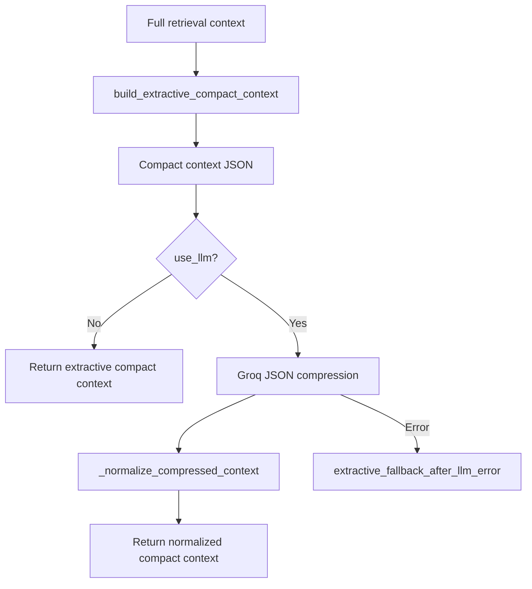

The API currently calls `compress_context(..., use_llm=False)`, so production chat uses deterministic extractive compression. LLM compression exists in the module, but is not enabled in `src/server/app.py`.

The compact context shape is:

| Field | Meaning |
| --- | --- |
| `query` | Original user query. |
| `compact_context.key_text_evidence` | Up to 5 citation-preserving text excerpts. |
| `compact_context.key_image_evidence` | Up to 2 image descriptions. |
| `compact_context.key_relations` | Up to 6 graph relations. |
| `compact_context.source_references` | Reference objects for UI and citations. |
| `compact_context.coverage_notes` | Booleans and weaknesses for text/image/relation coverage. |
| `compression_metadata` | Mode and compression limits. |

Compression exists for two reasons. First, retrieval output can be large: smoke artifacts range from about 46 KB to 94 KB before compression. Second, answer generation should see only the most relevant evidence and citation strings, not every diagnostic field. The answer smoke test confirms compressed contexts are smaller while preserving citations.

## 11. Answer Generation Pipeline

The answer entry point is `generate_grounded_answer()` in `src/answering/generator.py`.

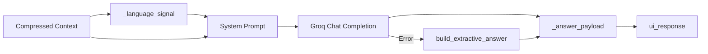

The model is configured by `GROQ_ANSWER_MODEL`, defaulting to `openai/gpt-oss-20b`. The prompt instructs the model to answer only from compressed evidence, cite important claims inline, separate course evidence from graph relation context when relevant, and avoid mentioning retrieval internals.

The output structure includes:

| Field | Meaning |
| --- | --- |
| `query` | User query. |
| `answer` | Generated or extractive answer text. |
| `retrieved_images` | Image descriptions prepared for UI rendering. |
| `citations` | Source references from compact context. |
| `coverage_notes` | Evidence coverage booleans and weaknesses. |
| `ui_response` | Frontend-oriented answer, images, citations, notes, language. |
| `answer_metadata` | Mode, model, `uses_only_compressed_context`, image count, language. |

Hallucination risk is reduced through several implementation choices:

1. The final model receives only compressed evidence, not arbitrary source files.
2. The answer prompt explicitly prohibits unsupported facts.
3. Citation strings are generated before answer generation.
4. If LLM generation fails, the fallback answer is extractive.
5. `answer_metadata.uses_only_compressed_context` is always set in the payload and validated by smoke tests.

## 12. API Layer

The API is implemented in `src/server/app.py` using FastAPI. `src/api.py` re-exports the app for deployment imports.

### Endpoints

| Endpoint | Method | Purpose |
| --- | --- | --- |
| `/health` | GET | Returns API status, Groq key presence, Weaviate host/ports, configured models, and CORS origins. |
| `/chat` | POST | Runs retrieval, compression, answer generation, and response packaging. |
| `/transcribe` | POST | Accepts uploaded audio and transcribes through Groq Whisper. |
| `/images/{image_id}.svg` | GET | Reconstructs and returns inline SVG markup from source HTML by stable image ID. |

### Chat Flow

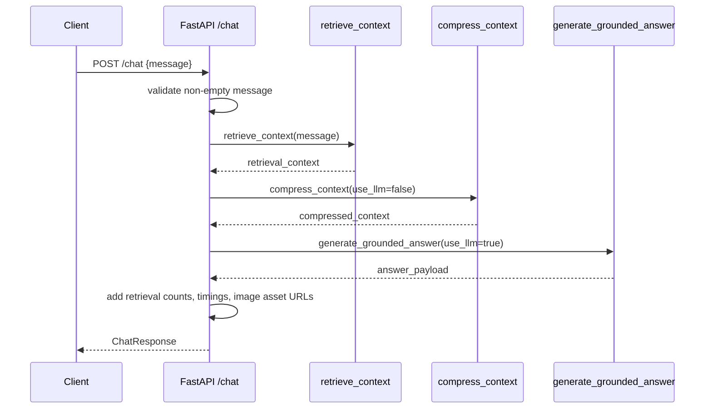

`run_in_threadpool()` is used for blocking retrieval, compression, generation, image lookup, and transcription calls so the async FastAPI route does not directly block the event loop.

Error handling:

| Failure | Response |
| --- | --- |
| Empty chat message | HTTP 400. |
| Groq provider error during chat | HTTP 502. |
| Other RAG pipeline failure | HTTP 503. |
| Empty/missing audio file | HTTP 400. |
| Transcription provider error | HTTP 502. |
| Missing SVG image | HTTP 404. |
| Image lookup failure | HTTP 503. |

The API adds timing metadata for retrieval, compression, answer generation, packaging, and total request time.

## 13. Frontend Interaction Flow

The frontend is a plain JavaScript PWA under `frontend/`. It has no build step. `index.html` provides the app shell, `styles.css` handles responsive layout, `app.js` implements API interaction and UI state, `manifest.json` enables standalone installation, and `service-worker.js` caches static assets.

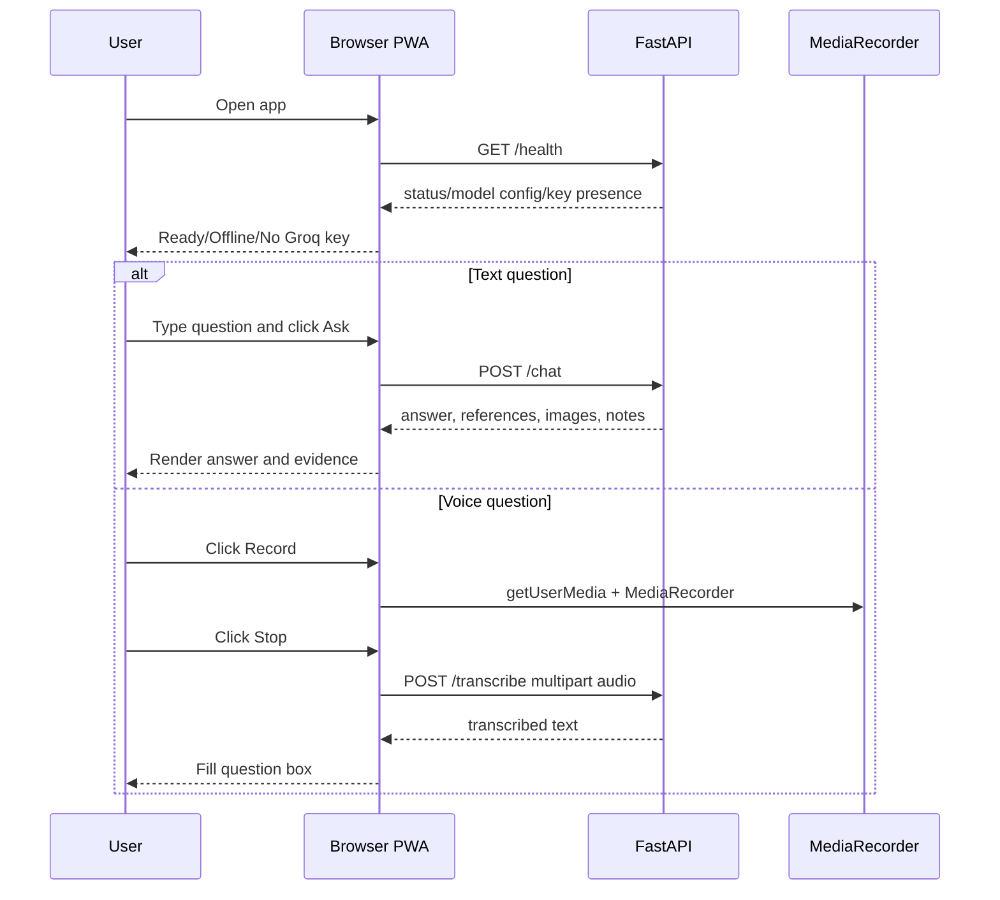

The frontend renders:

| UI Area | Source |
| --- | --- |
| Answer | `data.answer` from `/chat`. |
| References | `data.references`. |
| Relevant diagrams | `data.images`, including `asset_url` generated by the API. |
| Coverage | `data.coverage_notes.weaknesses`. |
| API status | `/health.groq_api_key_present`. |

The voice flow records browser audio using `MediaRecorder`, posts it as multipart form data to `/transcribe`, and fills the question textarea with the returned text. It does not automatically submit the question after transcription, giving the user a chance to edit.

## 14. Storage Layer

Weaviate is run locally through `infra/weaviate/docker-compose.yml`, using image `cr.weaviate.io/semitechnologies/weaviate:1.36.9`. It exposes HTTP port `8080` and gRPC port `50051`, stores data in the `weaviate_data` volume, and enables anonymous access for MVP development.

Collections are created in `src/storage/weaviate_setup.py` with self-provided vectors:

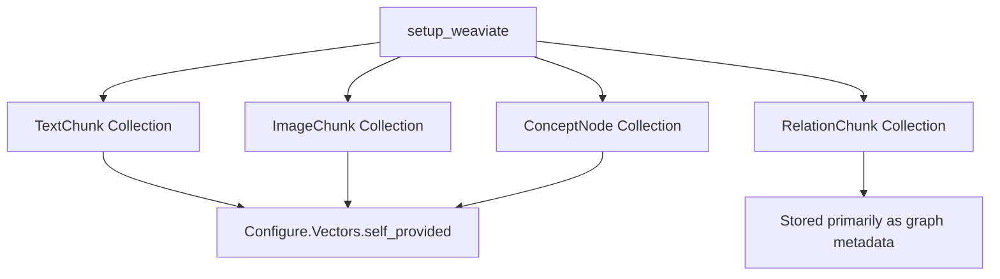

### TextChunk Collection

Properties: `chunk_id`, `content`, `title`, `parent_title`, `concept_id`, `section_id`, `source_file`, `type`, and nested metadata (`level`, `breadcrumb`, `child_titles`, `content_length`).

Vector: self-provided E5 passage embedding of `content`.

### ImageChunk Collection

Properties: `image_id`, `description`, `title`, `parent_title`, `concept_id`, `section_id`, `source_file`, `type`, and nested metadata (`linked_text_section_id`, `caption`, `svg_text_labels`, `view_box`, `order_in_file`, `raw_svg_excerpt`, `breadcrumb`, `placeholder`).

Vector: self-provided E5 passage embedding of `description`.

### RelationChunk Collection

Properties: `relation_id`, `source_id`, `target_id`, `relation_type`, `description`, and metadata (`source_file`, `sheet_name`, `row_number`, `source_label`, `target_label`, `evidence`, `placeholder`).

Vector: no embedding is attached during storage in the current repository. Relations are retrieved by graph traversal, not direct vector search.

### ConceptNode Collection

Properties: `concept_id`, `label`, `node_type`, `text_chunk_ids`, `image_ids`, `source_relation_ids`, `target_relation_ids`, and metadata (`source_files`, `titles`, `relation_types`, counts, `has_evidence`, `embedding_source`, `retrieval_weight`).

Vector: weighted evidence average or relation-label fallback embedding.

Vectors are stored in Weaviate instead of generated at query time because document vectors are stable across requests. Precomputing them reduces latency and avoids repeatedly loading and encoding the same course material.

## 15. Design Decisions and Reasoning

| Decision | Benefits | Trade-offs | Alternatives |
| --- | --- | --- | --- |
| Use `intfloat/multilingual-e5-small` | Local inference, multilingual retrieval, small enough for MVP, proven query/passage prefix pattern. | Lower semantic capacity than larger models; text-only. | Larger E5/BGE models; hosted embeddings; multimodal embeddings. |
| Store self-provided vectors in Weaviate | Keeps embedding model under application control and avoids provider lock-in. | Ingestion must generate vectors correctly before storage. | Weaviate vectorizer modules; external vector DB. |
| Separate `TextChunk`, `ImageChunk`, `RelationChunk`, and `ConceptNode` | Clean evidence/visual/graph responsibilities; easier validation and debugging. | More collections and orchestration code. | Single flattened document collection; native graph DB. |
| Use ConceptNodes | Bridges text, images, and workbook relations; enables graph expansion from semantic retrieval. | Concept ID normalization can mismatch across sources. | Direct relation traversal from chunks; LLM entity linking. |
| Store RelationChunks separately | Preserves edge metadata, relation type, row evidence, and traversal traceability. | Relations are not directly vector-retrieved today. | Embed relations directly; store as native graph edges. |
| Compress before answer generation | Reduces token usage and keeps answer model focused on top evidence. | May drop useful long-tail evidence. | Send full retrieval context; use larger context model. |
| Deterministic compression in API | Predictable, cheap, robust without requiring compressor LLM. | Less abstractive synthesis before answer generation. | Enable Groq JSON compression; local summarizer. |
| Evidence-grounded answer prompt | Reduces hallucination and supports citations. | Answer quality depends on retrieval quality. | Agentic browsing over all artifacts; unrestricted LLM answer. |
| Lexical merge with vector retrieval | Protects exact domain terms and operational phrases. | More heuristic tuning. | Pure vector search; BM25/hybrid search in Weaviate. |
| Graph expansion with thresholds | Adds structured context without flooding the prompt. | Thresholds are hand-tuned and may miss weak but useful relations. | Learned reranker; path-ranking model; agentic graph search. |
| Plain JS PWA frontend | Easy deployment and low complexity for MVP. | Less scalable UI architecture as features grow. | React/Vite app; mobile-native wrapper. |

## 16. Current Limitations

| Area | Limitation |
| --- | --- |
| Embeddings | Current image support is description-based, not true visual embedding. |
| Concept linking | `concept_id` is slug-based; equivalent concepts with different labels may not merge. |
| Graph retrieval | Relations are traversed after seed selection, not directly semantically searched. |
| Reranking | Reranking is heuristic and domain-term based rather than learned. |
| Compression | API uses deterministic extractive compression; LLM compression exists but is disabled. |
| Evaluation | Smoke tests validate structure and a few quality checks, but not factual answer correctness at scale. |
| Encoding | Some artifact prompts show mojibake for Hindi text, indicating an encoding/display issue in generated artifacts or shell output. |
| Production readiness | Local anonymous Weaviate, local model loading, and environment-file API keys are MVP choices, not hardened production settings. |
| Performance | `retrieve_context()` fetches up to 1000 objects from each collection on every request for lexical merge and graph traversal. |
| API CORS | Defaults are local development origins unless configured through `API_CORS_ORIGINS`. |

## 17. Future Improvements

### Short-Term Roadmap

| Improvement | Rationale |
| --- | --- |
| Add hybrid BM25/vector retrieval in Weaviate | Replace manual fetch-all lexical merge with scalable hybrid search. |
| Add relation embeddings | Allow relation chunks to be retrieved directly as seeds. |
| Improve concept normalization | Merge aliases and workbook/course terminology variants. |
| Enable optional LLM compression | Use the existing compressor path when API key and latency budget permit. |
| Add retrieval regression fixtures | Track expected evidence IDs for important training questions. |
| Fix Hindi encoding path | Ensure source, artifacts, terminal, and frontend all preserve Devanagari correctly. |
| Add API integration tests | Validate `/health`, `/chat`, `/transcribe` error cases, and `/images`. |

### Long-Term Roadmap

| Improvement | Rationale |
| --- | --- |
| Learned reranking | Improve evidence ordering beyond heuristic scoring. |
| Agentic retrieval | Let a controller issue follow-up graph/evidence searches for multi-hop questions. |
| Multi-hop reasoning evaluation | Measure whether graph traces actually improve answers. |
| Multimodal embeddings | Retrieve diagrams by visual content rather than only text labels/captions. |
| Evaluation framework | Add gold answers, citation precision, recall, hallucination checks, and latency metrics. |
| Production deployment | Add authentication, managed vector storage, observability, rate limits, and secrets management. |
| Admin ingestion UI | Let future developers trigger ingestion and inspect validation reports from a UI. |

## 18. Testing and Validation

### Ingestion Validation

`build_validation_report()` checks object counts, required fields, unique IDs, and embedding summary. The current artifact passes validation with:

| Object | Count |
| --- | ---: |
| TextChunk | 196 |
| ImageChunk | 34 |
| RelationChunk | 748 |
| ConceptNode | 938 |

### Retrieval Smoke Test

`src/eval/retrieval_smoke_test.py` runs five domain prompts through `retrieve_context()`, writes each full context artifact, and validates:

| Check | Why it matters |
| --- | --- |
| At least text or image evidence exists | Retrieval must return answerable context. |
| Max hop does not exceed configured max | Graph traversal remains bounded. |
| Text/image/relation context counts stay within defaults | Compression input remains controlled. |
| No `answer` field appears in retrieval output | Retrieval stays separate from generation. |
| Prompt-specific quality checks pass | Important domain questions retrieve relevant evidence instead of generic course sections. |

All current retrieval smoke summaries pass.


### Answer Generation Smoke Test

`src/eval/answer_smoke_test.py` reads or creates retrieval contexts, compresses them with `use_llm=False`, generates extractive answers with `use_llm=False`, and validates:

| Check | Why it matters |
| --- | --- |
| Compressed context is smaller than retrieval context | Compression is actually reducing prompt size. |
| Text or image evidence exists | Answer has grounding material. |
| Citations are present | UI and reviewers can inspect sources. |
| `uses_only_compressed_context` is true | Answer pipeline follows grounding contract. |

All current answer smoke summaries pass. Compressed contexts are roughly 6.9 KB to 11.1 KB compared with retrieval contexts of roughly 46.5 KB to 93.6 KB.

## 19. Current System Status

| Category | Status |
| --- | --- |
| Completed Components | HTML parsing, semantic text chunking, image description extraction, workbook relation extraction, ConceptNode construction, Weaviate schema setup, deterministic UUIDs, E5 embedding service, retrieval, graph expansion, extractive compression, grounded answer generation, FastAPI API, frontend PWA, voice transcription, SVG image serving, smoke tests. |
| Partially Completed Components | LLM compression path exists but is not enabled in API; graph expansion works but depends on slug alignment; multilingual retrieval exists but artifact encoding needs attention; relation-only nodes can seed graph expansion but relations are not vector searched directly. |
| Planned Components | Reranking, better graph expansion, improved ConceptNode linking, agentic retrieval, hybrid retrieval, LLM-based compression in API, deeper evaluation, production deployment. |
| Known Issues | Hindi text can appear mojibake in some artifacts/terminal outputs; some prompts produce no relation trace; Git status was blocked in this environment by safe-directory ownership. |
| Technical Debt | Heuristic scoring constants, fetch-all retrieval support code, plain slug entity linking, no typed domain models beyond dictionaries, limited automated API tests. |
| Performance Risks | Query-time fetch of all collections, local model cold starts if not warmed, Groq latency, Weaviate running as a local single-node service. |

## 20. Project Directory Walkthrough

```text
D:\Graph_RAG_Internship
|-- Data
|   |-- *.html
|   `-- CHP WRCF.xlsx
|-- artifacts
|   |-- ingestion
|   |-- retrieval
|   `-- answers
|-- frontend
|   |-- index.html
|   |-- app.js
|   |-- styles.css
|   |-- manifest.json
|   |-- service-worker.js
|   `-- icons
|-- infra
|   `-- weaviate
|       `-- docker-compose.yml
|-- Plan
|   `-- CHP_GraphRAG_Architecture_Comparison_Claude.pdf
|-- src
|   |-- answering
|   |-- cli
|   |-- core
|   |-- embedding
|   |-- eval
|   |-- extraction
|   |-- graph
|   |-- providers
|   |-- retrieval
|   |-- server
|   |-- storage
|   |-- api.py
|   |-- run_ingestion.py
|   |-- run_retrieval.py
|   `-- run_answer.py
|-- requirements.txt
|-- netlify.toml
|-- MVP_PLAN.md
|-- PROGRESS.md
`-- UNDERSTAND_CODE.md
```

### `Data/`

Stores source knowledge. HTML files are parsed into text and image chunks. `CHP WRCF.xlsx` provides workbook relations for the knowledge graph.

### `artifacts/`

Stores generated inspection artifacts. `artifacts/ingestion` contains nested structures and storage objects. `artifacts/retrieval` contains retrieval contexts and smoke summaries. `artifacts/answers` contains compressed contexts, generated answers, and answer smoke summaries. These artifacts are important for professor review because they expose intermediate pipeline behavior.

### `frontend/`

Implements the user-facing PWA. `app.js` contains health checks, chat requests, audio recording, transcription upload, answer rendering, citation rendering, and diagram preview rendering. `service-worker.js` caches static assets for basic offline resilience.

### `infra/weaviate/`

Contains Docker Compose configuration for local Weaviate. This is the only database service required by the MVP.

### `src/core/`

Contains shared configuration and concept ID normalization. `config.py` defines paths, collection names, model names, API settings, and Weaviate connection settings. `concepts.py` provides `concept_id()`.

### `src/extraction/`

Owns ingestion from raw HTML into structured artifacts. `html_parser.py` parses course files and builds heading trees. `text_chunking.py` creates TextChunks. `image_extraction.py` creates ImageChunks and can recover SVG markup by image ID. `pipeline.py` orchestrates ingestion.

### `src/graph/`

Owns graph object creation. `relations.py` converts workbook rows into RelationChunks. `concept_nodes.py` aggregates text, image, and relation endpoints into ConceptNodes.

### `src/embedding/`

Owns local embedding generation through `sentence-transformers`. It implements E5 prefixes, batch embedding, query embedding, model warming, weighted ConceptNode embeddings, and fallback relation-only concept embeddings.

### `src/storage/`

Owns Weaviate schema setup, reset helpers, batch insertion, deterministic UUIDs, and ingestion validation.

### `src/retrieval/`

Owns runtime evidence retrieval, lexical merge, reranking, graph traversal, expanded evidence gathering, final context assembly, diagnostics, and timing measurement.

### `src/answering/`

Owns context compression and answer generation. Compression can be deterministic or Groq-based. Answer generation can be Groq-based or extractive fallback.

### `src/providers/`

Contains external provider integration. `groq_provider.py` wraps Groq chat completion, audio transcription, JSON parsing, API key lookup, and provider-specific errors.

### `src/server/`

Contains the FastAPI app, request/response models, CORS, startup model warming, `/health`, `/chat`, `/transcribe`, and `/images/{image_id}.svg`.

### `src/eval/`

Contains smoke tests and test prompts. These tests validate retrieval structure, evidence coverage, compression effectiveness, citations, and answer grounding metadata.

### `src/cli/`

Contains command-line entry points for ingestion, retrieval, and answer generation. These scripts are the main developer tools for regenerating artifacts and inspecting intermediate outputs.

## 21. Implementation Summary

The system is a practical research MVP for graph-augmented retrieval over industrial training content. Its strongest architectural choice is the separation between evidence objects and concept/relationship objects. TextChunks and ImageChunks provide grounded answer material; RelationChunks provide structured operational links; ConceptNodes connect the two worlds and make graph expansion possible.

The current implementation favors transparency over hidden automation. Most intermediate representations are written as JSON artifacts, retrieval returns diagnostics and timings, and fallback paths exist for both compression and answer generation. This makes the project suitable for internship reporting and future developer onboarding because each stage can be inspected independently.

The main next step is to replace hand-tuned retrieval heuristics with stronger hybrid search, relation retrieval, and evaluation. The existing structure is ready for that evolution: the collections, artifacts, and function boundaries already separate ingestion, storage, retrieval, compression, generation, API serving, and frontend interaction.
