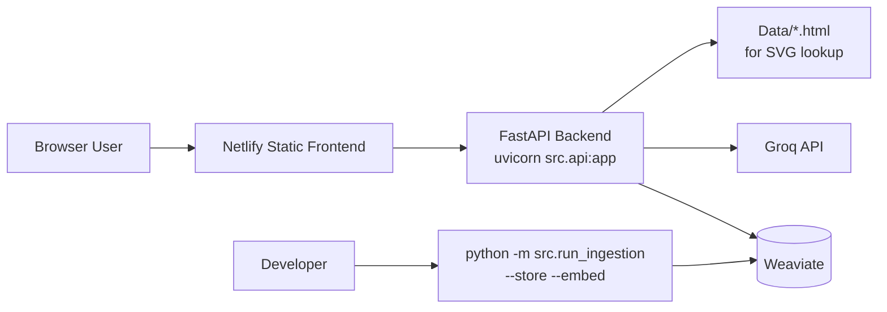
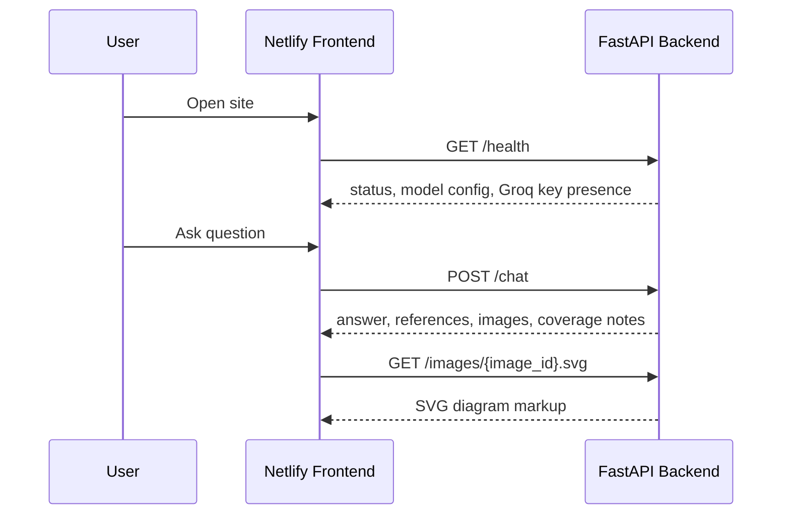
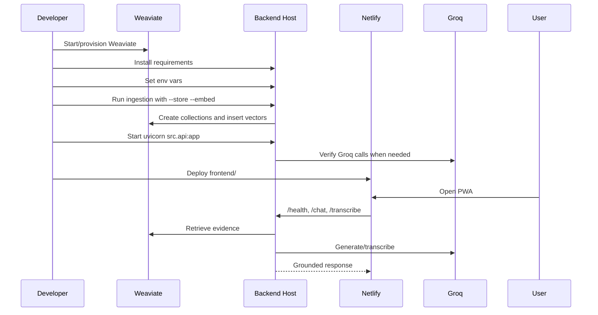
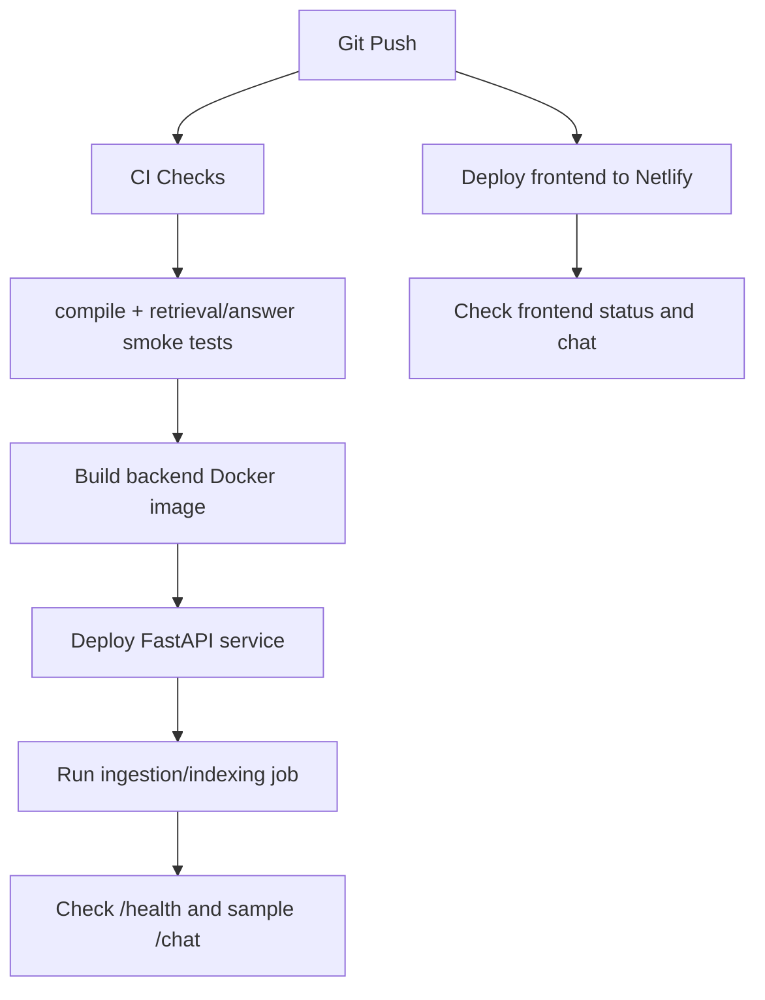

# Deployment Guide

## Current Deployment Pipeline

The project currently has a split deployment model:

1. **Frontend**: static PWA deployed from the `frontend/` directory, with Netlify configuration in `netlify.toml`.
2. **Backend**: FastAPI app started with `uvicorn src.api:app`.
3. **Vector database**: Weaviate, currently configured through Docker Compose for local development under `infra/weaviate/docker-compose.yml`.
4. **External AI provider**: Groq, configured at runtime through `GROQ_API_KEY`.
5. **Knowledge base loading**: a manual ingestion step that parses `Data/`, embeds objects, and stores them in Weaviate.

There is **no checked-in backend deployment manifest** at the moment. The repository does not contain a `Dockerfile`, `Procfile`, Railway config, Render config, or Fly config. That means backend deployment is currently operational/manual: install Python dependencies, provide environment variables, run Weaviate or point to a remote Weaviate, ingest the data, then start Uvicorn.

The frontend code also currently points to local backend by default:

```js
const API_BASE_URL = "http://localhost:8000";
```

There is a commented production-looking backend URL in `frontend/app.js`:

```js
//const API_BASE_URL = "https://graphraginternship-production.up.railway.app";
```

This suggests the backend may have been tested or intended for Railway, but the Railway deployment configuration is not stored in this repository.

## Deployment Architecture



The frontend is only a static shell. All RAG behavior depends on the backend. The backend depends on:

- Python dependencies from `requirements.txt`
- local or remote Weaviate
- populated Weaviate collections
- `GROQ_API_KEY` for final answer generation and voice transcription
- source HTML files in `Data/` for `/images/{image_id}.svg`

## Repository Deployment Files

| File | Role |
| --- | --- |
| `netlify.toml` | Configures Netlify static hosting from `frontend/`. |
| `requirements.txt` | Python backend dependency list. |
| `infra/weaviate/docker-compose.yml` | Local Weaviate service for development or single-machine deployment. |
| `frontend/app.js` | Contains `API_BASE_URL`; must point to deployed backend for production frontend. |
| `src/api.py` | FastAPI app entrypoint for `uvicorn src.api:app`. |
| `src/server/app.py` | Actual API implementation. |
| `src/cli/run_ingestion.py` | Ingestion CLI used to populate Weaviate. |

## Frontend Deployment

### Current Netlify Configuration

`netlify.toml` contains:

```toml
[build]
  base = "frontend"
  publish = "."
  command = ""
```

This means:

- Netlify changes into `frontend/`.
- No build command runs.
- The `frontend/` directory itself is published.
- This works because the frontend is plain HTML, CSS, and JavaScript.

Security/cache headers are also configured:

| Header | Purpose |
| --- | --- |
| `X-Frame-Options = DENY` | Prevents embedding the app in iframes. |
| `X-Content-Type-Options = nosniff` | Prevents MIME sniffing. |
| `Referrer-Policy = strict-origin-when-cross-origin` | Reduces referrer leakage. |
| `Cache-Control = no-cache` on `/service-worker.js` | Ensures service worker updates are checked promptly. |

### Required Frontend Production Change

Before deploying or updating the frontend, update `frontend/app.js`:

```js
const API_BASE_URL = "https://YOUR-BACKEND-DOMAIN";
```

For example, if the backend is deployed on Railway:

```js
const API_BASE_URL = "https://graphraginternship-production.up.railway.app";
```

Without this change, the deployed Netlify site will attempt to call `http://localhost:8000`, which only works on the user's own computer and will fail for real users.

### Frontend Request Flow



## Backend Deployment

### Backend Entrypoint

The backend should be started with:

```bash
uvicorn src.api:app --host 0.0.0.0 --port $PORT
```

For local development:

```bash
uvicorn src.api:app --reload --host 0.0.0.0 --port 8000
```

`src/api.py` exports the FastAPI `app` from `src/server/app.py`, so deployment platforms should target:

```text
src.api:app
```

### Backend Dependencies

Install:

```bash
pip install -r requirements.txt
```

Important packages:

| Package | Used for |
| --- | --- |
| `fastapi` | API server. |
| `uvicorn[standard]` | ASGI runtime. |
| `weaviate-client` | Weaviate access and schema setup. |
| `sentence-transformers` | Local E5 embeddings. |
| `groq` | Chat completions and speech-to-text. |
| `beautifulsoup4`, `lxml` | HTML parsing and SVG recovery. |
| `openpyxl` | Excel relation ingestion. |
| `python-multipart` | Audio upload handling for `/transcribe`. |

### Backend Environment Variables

| Variable | Required | Default | Purpose |
| --- | --- | --- | --- |
| `GROQ_API_KEY` | Yes for LLM/voice | None | Groq chat completion and transcription. |
| `WEAVIATE_HOST` | No | `localhost` | Weaviate host. |
| `WEAVIATE_PORT` | No | `8080` | Weaviate HTTP port. |
| `WEAVIATE_GRPC_PORT` | No | `50051` | Weaviate gRPC port. |
| `API_CORS_ORIGINS` | Recommended | `http://localhost:5173,http://127.0.0.1:5173` | Allowed frontend origins. |
| `GROQ_COMPRESSOR_MODEL` | No | `llama-3.1-8b-instant` | Optional LLM compressor model. |
| `GROQ_ANSWER_MODEL` | No | `openai/gpt-oss-20b` | Answer generation model. |
| `GROQ_ANSWER_MAX_TOKENS` | No | `1000` | Max answer tokens. |
| `GROQ_TRANSCRIPTION_MODEL` | No | `whisper-large-v3-turbo` | Speech-to-text model. |

For deployed frontend access, set `API_CORS_ORIGINS` to the Netlify origin:

```bash
API_CORS_ORIGINS=https://your-site.netlify.app
```

Multiple origins can be comma-separated.

### Backend Startup Behavior

On FastAPI startup, the backend calls:

```python
warm_embedding_model()
```

This loads `intfloat/multilingual-e5-small` before the first user query. On a new deployment instance this can take time because the model may need to be downloaded or loaded from cache.

Deployment implication:

- The hosting environment needs enough disk and memory for `sentence-transformers`.
- If the model is not cached and the platform blocks downloads or has short startup limits, first startup may fail or be slow.
- For more reliable production deployment, pre-bake the model into an image or use persistent cache storage.

## Weaviate Deployment

### Current Local Weaviate Setup

The repository provides:

```bash
cd infra/weaviate
docker compose up -d
```

This starts:

- Weaviate image `cr.weaviate.io/semitechnologies/weaviate:1.36.9`
- HTTP on `8080`
- gRPC on `50051`
- persistent Docker volume `weaviate_data`
- anonymous access enabled

### Weaviate Schema Creation

The Python backend creates collections when `setup_weaviate()` runs. Collections:

- `TextChunk`
- `ImageChunk`
- `RelationChunk`
- `ConceptNode`

The schema uses self-provided vectors for embedded collections.

### Populating Weaviate

After Weaviate is running and dependencies are installed, load the knowledge base:

```bash
python -m src.run_ingestion --store --embed --reset-text --reset-images --reset-relations --reset-concepts
```

This does the following:

1. Parses HTML files from `Data/`.
2. Extracts text chunks and image chunks.
3. Reads workbook relations from `Data/CHP WRCF.xlsx`.
4. Builds ConceptNodes.
5. Generates local E5 embeddings.
6. Creates or resets Weaviate collections.
7. Stores objects in Weaviate.

Expected object counts from current artifacts:

| Collection | Expected Count |
| --- | ---: |
| `TextChunk` | 196 |
| `ImageChunk` | 34 |
| `RelationChunk` | 748 |
| `ConceptNode` | 938 |

### Remote Weaviate

The current code uses:

```python
weaviate.connect_to_local(...)
```

with configurable host and ports. This works for local Docker and can work for a reachable self-hosted Weaviate endpoint that behaves like a local unauthenticated instance. It does not currently include authentication or Weaviate Cloud-specific API key handling.

If using Weaviate Cloud or an authenticated deployment, `src/storage/weaviate_setup.py` will need to be extended to support API keys and cloud connection helpers.

## Full Manual Deployment Procedure

### 1. Deploy or Start Weaviate

For local/single-server:

```bash
cd infra/weaviate
docker compose up -d
```

For remote deployment, provision Weaviate and capture:

- host
- HTTP port
- gRPC port
- authentication details, if any

### 2. Deploy Backend

On the backend host:

```bash
pip install -r requirements.txt
```

Set environment variables:

```bash
GROQ_API_KEY=...
WEAVIATE_HOST=...
WEAVIATE_PORT=8080
WEAVIATE_GRPC_PORT=50051
API_CORS_ORIGINS=https://your-netlify-site.netlify.app
```

Load data:

```bash
python -m src.run_ingestion --store --embed --reset-text --reset-images --reset-relations --reset-concepts
```

Start API:

```bash
uvicorn src.api:app --host 0.0.0.0 --port $PORT
```

Verify:

```bash
curl https://your-backend-domain/health
```

Expected response includes:

- `"status": "ok"`
- `"groq_api_key_present": true`
- Weaviate host/port config
- model names

### 3. Configure Frontend API URL

Edit `frontend/app.js`:

```js
const API_BASE_URL = "https://your-backend-domain";
```

### 4. Deploy Frontend to Netlify

Netlify should use:

```text
Base directory: frontend
Build command: empty
Publish directory: .
```

This is already represented in `netlify.toml`.

### 5. Verify Browser Flow

Open the Netlify site and check:

1. Status pill shows `Ready`.
2. Text question calls `/chat`.
3. References render.
4. Diagram previews load through `/images/{image_id}.svg`.
5. Voice recording works on HTTPS and calls `/transcribe`.

## Local Development Deployment

Use this when testing on one machine.

```bash
cd infra/weaviate
docker compose up -d
```

```bash
pip install -r requirements.txt
```

```bash
python -m src.run_ingestion --store --embed --reset-text --reset-images --reset-relations --reset-concepts
```

```bash
uvicorn src.api:app --reload --host 0.0.0.0 --port 8000
```

In another terminal:

```bash
cd frontend
python -m http.server 5173
```

Open:

```text
http://localhost:5173
```

## Runtime API Health Checks

### Health

```bash
curl http://localhost:8000/health
```

### Chat

```bash
curl -X POST http://localhost:8000/chat ^
  -H "Content-Type: application/json" ^
  -d "{\"message\":\"Why is belt drift dangerous?\"}"
```

### SVG Image

Use an image ID returned in `/chat`:

```bash
curl http://localhost:8000/images/{image_id}.svg
```

### Transcription

```bash
curl -X POST http://localhost:8000/transcribe ^
  -F "file=@question.webm"
```

## Deployment Sequence Diagram



## Current Gaps in Deployment Automation

| Gap | Impact |
| --- | --- |
| No backend `Dockerfile` | Backend deployment is platform-specific/manual. |
| No `Procfile` or Railway config | Railway deployment cannot be reproduced from repo alone. |
| Frontend API URL is hardcoded | Must edit `frontend/app.js` before production deploy. |
| No cloud Weaviate auth support | Weaviate Cloud or secured Weaviate needs code changes. |
| Ingestion is manual | New deployments need explicit indexing before `/chat` works. |
| Model cache not packaged | First backend startup may download E5 model. |
| No CI/CD workflow | Tests and ingestion are not automatically run before deploy. |

## Recommended Production Pipeline

The current codebase would benefit from the following deployment pipeline:



Recommended changes:

1. Add a backend `Dockerfile`.
2. Add a production start command:

   ```bash
   uvicorn src.api:app --host 0.0.0.0 --port ${PORT:-8000}
   ```

3. Move frontend API URL to deploy-time config instead of hardcoding.
4. Add CI checks:

   ```bash
   python -m compileall src
   python -m src.answer_smoke_test
   ```

5. Add a controlled ingestion job for Weaviate population.
6. Decide between self-hosted Weaviate and Weaviate Cloud.
7. Add authentication support if using a secured vector database.

## Summary

The current deployment pipeline is functional but mostly manual:

- Netlify can deploy the static frontend from `frontend/`.
- FastAPI can run anywhere Python dependencies are installed using `uvicorn src.api:app`.
- Weaviate must be running and populated before chat works.
- Groq requires `GROQ_API_KEY`.
- The frontend must be pointed to the deployed backend URL.

The most important missing piece is codified backend deployment. Adding a Dockerfile or platform config would make the deployment reproducible and easier for future developers to operate.
